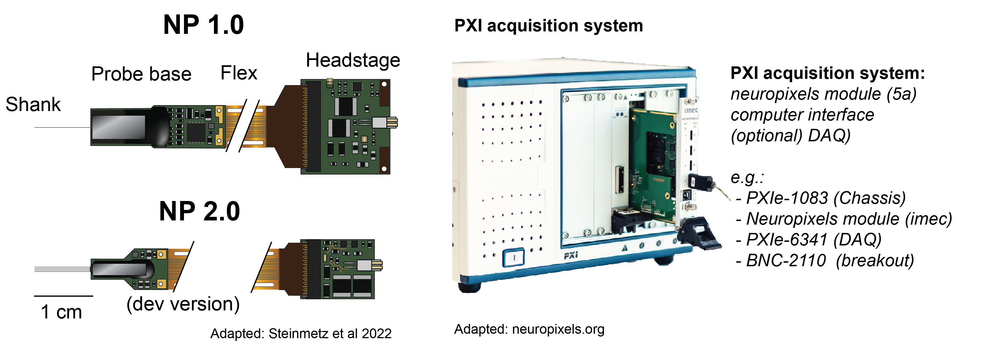
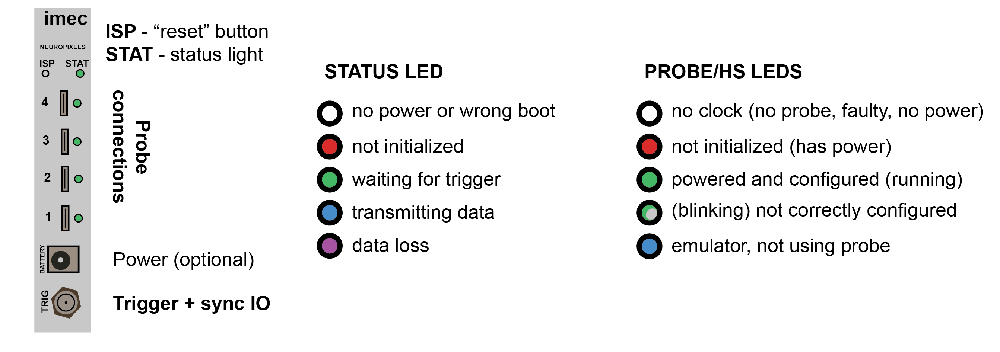

# Neuropixels workshop - CSHL Ion Channels in Synaptic and Neural Circuit Physiology

Practical information about Neuropixels recordings for the 2023 course. This list and examples were compiled by Joao Couto (UCLA) and the course was taught by Tim Harris (HHMI, Janelia). 

These pages have some materials and references for anyone wanting to dig into how to build a setup, understand how data are acquired, and preprocess data.

### References for harware:

| Resource | Category | Link | Maintainer |
| --- | --- | --- | --- |
|Purchase probes and hardware | **Hardware** | [Neuropixels.org](https://www.neuropixels.org/) | imec |
|What to buy and how to configure a system | Hardware | [SpikeGLX - PXI system requirements](https://github.com/billkarsh/SpikeGLX/blob/master/Markdown/SystemRequirements_PXI.md) | Bill Karsh | 
|**MANUAL for the 3.0 probes** | Documentation | [Manual](https://www.neuropixels.org/_files/ugd/832f20_ba7f3e9e639b49809458cf64d76abdcc.pdf) | imec

### References for acquisition software:

| Resource | Category | Link | Maintainer |
| --- | --- | --- | --- |
|Download software, overall reference, how-to videos | **Software** | [SpikeGLX](https://billkarsh.github.io/SpikeGLX/) | Bill Karsh|
| Download and use software | Software |  [Open-ephys PXI](https://open-ephys.github.io/gui-docs/User-Manual/Plugins/Neuropixels-PXI.html) | Josh Siegle|

### General references and courses:
| Resource | Category | Link | Maintainer |
| --- | --- | --- | --- |
| Neuropixels wiki | General/Getting started |  [Neuropixels WIKI](https://github.com/cortex-lab/neuropixels/wiki) | Nick Steinmetz |
| Ask for help, share knowledge, stay up to date | **General/Slack** | [Neuropixels Slack](https://neuropixelsgroup.slack.com/join/shared_invite/zt-1jibcdbhe-uNyp8q522L4S0apVKwoC6A#/shared-invite/email) | Community? |
|UCL course Youtube videos | **General/Getting started** | [UCL courses](https://www.youtube.com/channel/UCChkhcGBVElY8KLqIYc00gw/playlists) | Cortex Lab|
|Allen Mindscope and ephys course | In-person course | [Allen course](https://alleninstitute.org/events/2022-neuropixels-and-openscope-workshop/) | Allen Institute|
|General course with Neuropixels workshop | In-person course (general) | [Optical Imaging and Electrophysiological Recording in Neuroscience](https://parisneuro.ovh/) | Boris Barbour |

### References for post-processing and analysis:

| Resource | Category | Link | Maintainer |
| --- | --- | --- | --- |
|Pipeline to do preprocessing with SpikeGLX tools | **Post-processing and sorting** | [ecephys_spike_sorting](https://github.com/jenniferColonell/ecephys_spike_sorting)| Jennifer Colonell|
|Tutorial of how to sort neuropixels with SpikeInterface | **Post-processing and sorting** | [SpikeInterface](https://spikeinterface.readthedocs.io/en/latest/how_to/analyse_neuropixels.html) | SpikeInterface team|
|Allen pipeline for spike sorting | Post-processing and sorting | [ecephys](https://github.com/AllenInstitute/ecephys_spike_sorting) | Allen Institute|
|Kilosort spike sorting algorithm | Sorting | [Kilosort](https://github.com/MouseLand/Kilosort)| Marius Pachitarius|
|MountainSort spike sorting algorithm | Sorting | [MountainSort](https://github.com/flatironinstitute/mountainsort5) | Jeremy Magland|
|IronClust spike sorting algorithm | Sorting| [IronClust](https://github.com/flatironinstitute/ironclust) | James Jun and Jeremy Magland |
|Tutorial on how to use Phy for manual curation |  **Manual curation** | [Manual curation with phy](https://phy.readthedocs.io/en/latest/sorting_user_guide/) | Nick Steinmetz |
| Allen Visual Coding neuropixels tutorial| Tutorial |  [Allen Neuropixels](https://allensdk.readthedocs.io/en/latest/visual_coding_neuropixels.html) | Allen Institute|
| Tutorial to look at data with CellExplorer| Tutorial | [Cell Explorer](https://cellexplorer.org/tutorials/neuropixels-tutorial/) | Peter Petersen|

## Hardware description

The recording hardware is modular, we will describe what different parts of the system are for and how they are different from other systems:
1. the shank,
2. the probe base,
3. the headstage, and
4. the basestation (a.k.a. Neuropixels module)

The main difference between Neuropixels and typical recording devices is that the electrodes and digitizers are combined using CMOS technology in an Application Specific Integrated Circuit (ASIC).

In typical systems, the shank has just passive wires to the electrodes and the signals are amplified in the headstage, and then further digitized close to the computer.

In the case of Neuropixels, the shank and the probe base make up the ASIC; the headstage transmits already digitized data to an acquisition module that syncronizes data from different streams and sends it to the computer. Digitization happens very close to the brain with Neuropixels - leaving less space for noise and interference. 

To learn more about how this works dig into the Neuropixels [MANUAL](https://www.neuropixels.org/_files/ugd/832f20_ba7f3e9e639b49809458cf64d76abdcc.pdf) and [Putzeys et al. 2019](https://ieeexplore.ieee.org/document/8846063/)

#### Shank and probe base

The shank is around 10 mm long for Neuropixels 1.0 and 2.0 and contains many 12x12um Titanium Nitride (TiN) electrodes which allow recording both action potentials from single neurons and capturing local field potentials. The probe head digitizes 384 channels and multiplexes the signals in time.

The electrodes are arranged differently for NP1.0 and NP2.0.

**Neuropixels 1.0**:
 - cross section is 70x24um 
 - tip length of 175 um
 - the electrodes are aranged in a checkerboard pattern
 - the electrodes are spaced 16um horizontaly and 20um vertically
 - there are 960 selectable sites with adjustable gain
 - these probes have a 10-bit analog to digital converter and split the AP (highpass) and LFP (low pass) bands in separate streams

**Neuropixels 2.0**:
 - will be available soon and can have 4 shanks,separated by 250um
 - the tip length is around 200um
 - the electrodes are Linearly aranged, spaced 32um horizontaly and 15um vertically
 - each shank has 1280 selectable sites (aranged in a 2 by 640 array)
 - the signals are amplified with fixed gain, and the AP and LFP bands are combined and digitized with 12-bit precision.

#### Headstage

The signals come through the Flex alread multiplexed in time. The headstage will then serialize the data and send it to the computer. In addition, the headstage also provides a stable source of power to the ASIC and the master clock used for digitization.

The headstage for Neuropixels 2.0 can carry 2 probes thus enabling recordings from 384*2 channels, which is ideal for recording chronically from mice with 2 probes. 

#### Basestation and acquisition system

There are 2 systems to record with neuropixels, the PXI system and the Onebox. The latter is not available yet so we'll describe the PXI in detail.

The **PXI system** consist of:
 1. a chassis, to hold all acquisition components (like the PXIe-1083)
 2. the neuropixels module (that is purchased from imec)
 3. a data acquisition card (DAQ - like the PXIe-6341)
 4. a breakout box (to interface with the DAQ like the BNC-2110)

Of course you'll also need a computer. The [hardware requirements](https://github.com/billkarsh/SpikeGLX/blob/master/Markdown/SystemRequirements_PXI.md) for PXI systems are described in detail by Bill Karsh (author of SpikeGLX and working with Tim Harris at HHMI Janelia).

The **neuropixels module** is an FPGA device that handles syncronization and reads data from the headstages. It can connect to up to 8 NP2.0 probes or 4 NP1.0.
The image below is a quick reference for how to interpret the LED's in the device.

## Syncronizing data with external streams

## Probe handling and soldering

[General soldering tips](http://billkarsh.github.io/SpikeGLX/help/solder/solder/) from Bill Karsh

