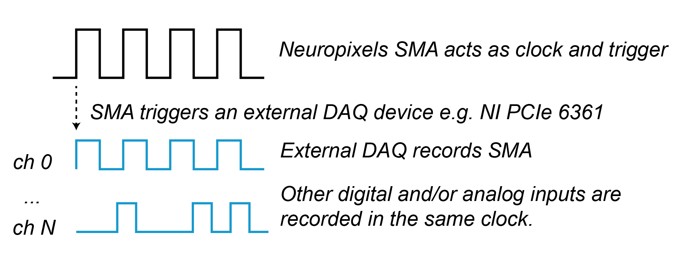

# Neuropixels workshop - CSHL Ion Channels in Synaptic and Neural Circuit Physiology

Practical information about Neuropixels recordings for the 2023 course compiled by Joao Couto (UCLA) and Tim Harris (HHMI Janelia). 

These pages have some materials and references for anyone wanting to dig into how to build a setup, understand how data are acquired, and preprocess data.

Here are the **cheatsheets** for [hardware reference](sheets/recording_system_overview.png) and [synchronization with external hardware](sheets/sync_overview.png).

# Hardware description

The recording hardware is modular, we will describe what different parts of the system are for and how they are different from other systems:
1. the shank,
2. the probe base,
3. the headstage, and
4. the basestation (a.k.a. Neuropixels module)


The main difference between Neuropixels and typical recording devices is that the electrodes and digitizers are combined using CMOS technology in an Application Specific Integrated Circuit (ASIC).

In typical systems, the shank has just passive wires to the electrodes and the signals are amplified in the headstage, and then further digitized close to the computer.

In the case of Neuropixels, the shank and the probe base make up the ASIC; the headstage transmits already digitized data to an acquisition module that synchronizes data from different streams and sends it to the computer. Digitization happens very close to the brain with Neuropixels - leaving less space for noise and interference. 

To learn more about how this works dig into the Neuropixels [MANUAL](https://www.neuropixels.org/_files/ugd/832f20_ba7f3e9e639b49809458cf64d76abdcc.pdf) and [Putzeys et al. 2019](https://ieeexplore.ieee.org/document/8846063/)

### Shank and probe base

The shank is around 10 mm long for Neuropixels 1.0 and 2.0 and contains many 12x12um Titanium Nitride (TiN) electrodes which allow recording both action potentials from single neurons and capturing local field potentials. The probe head digitizes 384 channels and multiplexes the signals in time.

The electrodes are arranged differently for NP1.0 and NP2.0.

**Neuropixels 1.0**:
 - cross section is 70x24um 
 - tip length of 175 um
 - the electrodes are aranged in a checkerboard pattern
 - the electrodes are spaced 16um horizontaly and 20um vertically
 - there are 960 selectable sites with adjustable gain
 - these probes have a 10-bit analog to digital converter and split the AP (highpass) and LFP (low pass) bands in separate streams

**Neuropixels 2.0**:
 - will be available soon and can have 4 shanks,separated by 250um
 - the tip length is around 200um
 - the electrodes are Linearly aranged, spaced 32um horizontaly and 15um vertically
 - each shank has 1280 selectable sites (aranged in a 2 by 640 array)
 - the signals are amplified with fixed gain, and the AP and LFP bands are combined and digitized with 12-bit precision.


### Headstage

The signals come through the Flex alread multiplexed in time. The headstage will then serialize the data and send it to the computer. In addition, the headstage also provides a stable source of power to the ASIC and the master clock used for digitization.

The headstage for Neuropixels 2.0 can carry 2 probes thus enabling recordings from 384*2 channels, which is ideal for recording chronically from mice with 2 probes. 

### Basestation and acquisition system

There are 2 systems to record with neuropixels, the PXI system and the Onebox. The latter is not available yet so we'll describe the PXI in detail.

The **PXI system** consists of:
 1. a chassis, to hold all acquisition components (like the PXIe-1083)
 2. the neuropixels module (that is purchased from imec)
 3. a data acquisition card (DAQ - like the PXIe-6341)
 4. a breakout box (to interface with the DAQ, like the BNC-2110)

Of course you'll also need a computer. The [hardware requirements](https://github.com/billkarsh/SpikeGLX/blob/master/Markdown/SystemRequirements_PXI.md) for PXI systems are described in detail by Bill Karsh (author of SpikeGLX, that is working with Tim Harris at HHMI Janelia).

The **neuropixels module** is an FPGA device that handles synchronization and reads data from the headstages. It can connect to up to 8 NP2.0 probes or 4 NP1.0.
The image below is a quick reference for how to interpret the LED's in the device.


# Binary files and raw data 

SpikeGLX stores raw data in binary files **.bin** accompanied by a text file **.meta** that contains information about the recording. It is useful to understand how data are stored and how to access raw data directly.

Binary files are not only used by SpikeGLX, they are common for many imaging and data acquisition applications. They are specially good for cases when you want to record data fast, and without compression, so you can quickly access it.

In binary files, data are stored sample by sample with **16-bit precision**.


These can be reshaped as an array.


One advantage of binary file formats is that one can access a data chunk of time quickly and can "memory map" the file so it looks like it is loaded in memory.

To memory map a file in python and plot raw data:
```python

import numpy as np # to map the file and handle types
import os # needed to figure out the number of samples

fname = 'ephys_g0_t0.imec1.ap.bin'  # path to the binary file
dtype = np.dtype('int16')  # for spikeglx recordings 
nchannels = 385 # spikeglx recordings from 1.0 and 2.0

# calculate the sample size from the filesize
nsamples = os.path.getsize(fname)/(nchannels*dtype.itemsize)
dat = np.memmap(fname,
                mode='r', # open in read mode (safe)
                dtype=dtype,
                shape = (int(nsamples),int(nchannels)))
```

And for plotting data straight out of the file:

```python
import pylab as plt # for plotting
#lets plot 1 second of data for every 20 channels on the probe 
srate = 30000 # this should always be read from the metadata file
time_offset = 300 # lets take the samples from around 5min into the recording
idx = np.arange(srate).astype(int)
for i,ichan in enumerate(range(0,dat.shape[1],20)):
    y = dat[idx+int(time_offset*srate),ichan].astype('float32')
    #subtract the mean (for plotting)
    y -= y.mean()
    plt.plot(idx/srate,y+i*200,'k')
```

# Synchronizing data with external streams

It is critical to be able to relate neural signals with external variables to try to relate brain activity to behavior.

In the PXI system, this can be done in 2 ways:

 1. the neuropixel module can receive a sync signal (e.g. the trial start) that gets recorded with the probe streams. This signal can then be used to know when an external event happened in the time base of the neural signals.
 2. **preferred** - the neuropixels module can send a signal when the probe starts acquiring data, that signal is then used to trigger all streams and to correct for any drift in clock between the streams. One can then connect multiple external signals and capture those in the same corrected time base. 




**Clock drift** happens when recording with multiple streams or using different clocks. It is more visible in long recordings so if triggering each trial one may not see it.

 

The times of one stream (2) need to be corrected to the timing of the other stream (1).
A solution is to interpolate the onsets of the SMA pulse (in the neuropixels module) or another sync pulse generator that is captured on all streams.
 


Use the interpolation function to align the other events or extrapolate the corrected time base for analog systems.

Note than the [SpikeGLX “calibration”](https://billkarsh.github.io/SpikeGLX/help/syncEdges/Sync_edges/) has a nice description of this, reduces clock differences to the milisecond range by measuring the offset between the 2 clocks and **provides tools to fix it**. CatGT can be used to return interpolated streams i.e. perfectly match the clocks as described here; see also [ecephys_spike_sorting](https://github.com/jenniferColonell/ecephys_spike_sorting).

The correction can be done by reading the onsets from the file. We provide functions to load spikeglx binary files and unpack the bits in last channel (which is the sync channel on the probes and the DAQ stream).

To load the files:
```python
from tqdm import tqdm   # to plot a progress bar
# these are the functions we'll need to read and unpack binary files
from spks import load_spikeglx_binary, unpack_npix_sync, list_spikeglx_files

folder = 'path to the experiment folder'

# load the AP channel for each probe and extract the onsets and offsets from the binary files
aps = []
apmetas = []
aponsets = []
apoffsets = []

for file in tqdm(apfiles):
    b = load_spikeglx_binary(file)
    aps.append(b[0])
    apmetas.append(b[1])
    o,f = unpack_npix_sync(b[0][:,-1])
    # load onsets for each probe
    aponsets.append(o)
    apoffsets.append(f)
# load the NIDQ channel and extract the onsets/offsets
nidq,nidqmeta = load_spikeglx_binary(nidqfile)
nidqonsets,nidqoffsets = unpack_npix_sync(nidq[:,-1])
```

Each sync channel can host 8 digital channels, so we need to find which og these digital channels is used:

```python
# Print how many onsets and offsets are in each probe
print('\nPROBES:')
for i,ons in enumerate(aponsets):
    for k in ons.keys():
        npulses = len(ons[k])
        print(f'\t- imec{i} has {npulses} on channel {k}')
# and on the daq digital channels
print('\nDAQ:')
for k in nidqonsets.keys():
    npulses = len(nidqonsets[k])
    print(f'\t - has {npulses} on channel {k}')
# by inspecting the outputs, we know that the 
apsyncchannel = 6
nidqsyncchannel = 7
```

To interpolate we can simply use the interp1d function from scipy

```python
# interpolate data to the first probe 
from scipy.interpolate import interp1d
apcorrections = []
syncpulses = aponsets[0][apsyncchannel]/apmetas[0]['sRateHz'] # these are the pulses to interpolate to
for pulses in aponsets:
    apcorrections.append(interp1d(pulses[apsyncchannel],
                                  syncpulses, fill_value='extrapolate')) # in samples
nidqcorrection = interp1d(nidqonsets[nidqsyncchannel],
                                  syncpulses, fill_value='extrapolate') # in samples

```

We can now see how far the sync pulses are in each clock. By printing the diference between sync pulses in each stream.

```python
# lets plot how far off we were for each probe
for iprobe,pulses in enumerate(aponsets):
    plt.figure(figsize=[8,3])
    plt.plot((syncpulses-pulses[apsyncchannel]/apmetas[iprobe]['sRateHz'])*1000,'ko',label='measured',alpha=0.5)
    plt.plot((syncpulses-apcorrections[iprobe](pulses[apsyncchannel]))*1000,'r.',label='corrected',alpha=0.5)
    plt.ylim([-5,5])
    plt.xlabel('time in experiment (s)')
    plt.ylabel('measured-corrected (ms)')
# now for the nidaq
plt.plot((syncpulses-nidqcorrection(nidqonsets[nidqsyncchannel]))*1000,'r.',label='corrected',alpha=0.5)
```

# Loading data and plotting basic features

After spike sorting (and manual inspection) one can load data and plot. Data in [phy](https://phy.readthedocs.io/en/latest/) format (Cyrille Rossant) are basically a set of numpy files organized in a folder, here is how you can read it using numpy functions.

```python
def load_phy_folder(folder):
    '''
    Phy stores data as .npy and tab separated (.tsv) files in a folder.

    This function reads the spike times and cluster identities from a folder and 
computes the spike amplitudes and approximate spike locations (XY).

    This is an approximate way of computing the spike depths since we don't 
actually read the waveforms (so it is fast); we use the templates instead.

Example:
 
spike_times,spike_clusters,spike_amplitudes,spike_positions,templates_raw,templates_position = load_phy_folder(folder)
 
    '''
    # load the channel locations
    channel_pos =  np.load(pjoin(sortfolder,'channel_positions.npy'))
    # load each spike cluster number
    spike_clusters = np.load(pjoin(sortfolder,'spike_clusters.npy'))
    # load spiketimes
    spike_times = np.load(pjoin(sortfolder,'spike_times.npy'))
    # load spike templates (which template was fitted)
    spike_templates = np.load(pjoin(sortfolder,'spike_templates.npy'))
    # load the templates used to extract the spikes
    templates =  np.load(pjoin(sortfolder,'templates.npy'))
    # Load the amplitudes used to fit the template
    spike_template_amplitudes = np.load(pjoin(sortfolder,'amplitudes.npy'))
    # load the whitening matrix (to correct for the data having been whitened)
    whitening_matrix = np.load(pjoin(sortfolder,'whitening_mat_inv.npy')).T
    # the raw templates are the dot product of the templates by the whitening matrix
    templates_raw = np.dot(templates,whitening_matrix)
    # compute the peak to peak of each template
    templates_peak_to_peak = (templates_raw.max(axis = 1) - templates_raw.min(axis = 1))
    # the amplitude of each template is the max of the peak difference for all channels
    templates_amplitude = templates_peak_to_peak.max(axis=1)
    # compute the center of mass (X,Y) of the templates
    template_position = [templates_peak_to_peak*pos for pos in channel_pos.T]
    template_position = np.vstack([np.sum(t,axis =1 )/np.sum(templates_peak_to_peak,axis = 1) 
                                   for t in template_position]).T
    # get the spike positions and amplitudes from the average templates 
    spike_amplitudes = templates_amplitude[spike_templates]*spike_template_amplitudes
    spike_positions = template_position[spike_templates,:].squeeze()
    return spike_times,spike_clusters,spike_amplitudes,spike_positions,templates_raw,template_position
 ``` 

## Spike drift map

```python
sortfolder = 'path to the phy folder'
spike_times,spike_clusters,spike_amplitudes,spike_positions,templates,templates_position = load_phy_folder(folder)
# plot the spiketimes versus the spike positions
plt.figure(figsize = [10,3])
plt.plot(spike_times,spike_positions[:,1],'.k',markersize = 0.5,alpha = 0.1)
plt.ylabel('Recording depth (um)')
plt.xlabel('Time (in samples)')
```

## Average waveforms

## Average peri-event histograms (PSTHs)

## Rasters aligned to the stimulus


# Probe handling and soldering

Here are some pratical suggestions for handling probes (some pictures we take during the course can go here):

 - probes are safer in the box; **test first with the probes in the box**. Connect a headstage to the flex of the probe while it is in the box if you need to test it.
 - touch a grounded piece of metal **before touching probes** to prevent electrostatic discharge.
 - always **align the shank to the axis of probe insertion** (manipulator). This can be done by carefully aligning the probes or using the probe cap and holder.  
 - tapeing probes to a table is a way of safely soldering it, as you can easily secure it. Make sure not to heat-up the flex (use a toothpick to elevate the flex if needed).

[General soldering tips](http://billkarsh.github.io/SpikeGLX/help/solder/solder/) from Bill Karsh

# References and links:

#### Hardware:

| Resource | Category | Link | Maintainer |
| --- | --- | --- | --- |
|**Purchase probes and hardware** | Hardware | [Neuropixels.org](https://www.neuropixels.org/) | imec |
|What to buy and how to configure a system | Hardware | [SpikeGLX - PXI system requirements](https://github.com/billkarsh/SpikeGLX/blob/master/Markdown/SystemRequirements_PXI.md) | Bill Karsh | 
|**MANUAL for the 1.0 probes** | Documentation | [Manual](https://www.neuropixels.org/_files/ugd/832f20_ba7f3e9e639b49809458cf64d76abdcc.pdf) | imec

#### Acquisition software:

| Resource | Category | Link | Maintainer |
| --- | --- | --- | --- |
|**Download software, overall reference, how-to videos** | Software | [SpikeGLX](https://billkarsh.github.io/SpikeGLX/) | Bill Karsh|
| Download and use software | Software |  [Open-ephys PXI](https://open-ephys.github.io/gui-docs/User-Manual/Plugins/Neuropixels-PXI.html) | Josh Siegle|


#### General and courses:
| Resource | Category | Link | Maintainer |
| --- | --- | --- | --- |
| Neuropixels wiki | General/Getting started |  [Neuropixels WIKI](https://github.com/cortex-lab/neuropixels/wiki) | Nick Steinmetz |
| **Ask for help, share knowledge, stay up to date** | General/Slack | [Neuropixels Slack](https://neuropixelsgroup.slack.com/join/shared_invite/zt-1jibcdbhe-uNyp8q522L4S0apVKwoC6A#/shared-invite/email) | Community? |
|**UCL course videos** | General/Getting started | [UCL courses](https://www.youtube.com/channel/UCChkhcGBVElY8KLqIYc00gw/playlists) | Cortex Lab|
|Allen Mindscope and ephys course | In-person course | [Allen course](https://alleninstitute.org/events/2022-neuropixels-and-openscope-workshop/) | Allen Institute|
|General course with Neuropixels workshop | In-person course (general) | [Optical Imaging and Electrophysiological Recording in Neuroscience](https://parisneuro.ovh/) | Boris Barbour |

#### Surgery and other protocols
| Resource | Category | Link | Maintainer |
| --- | --- | --- | --- |
|Allen protocol for acute recordings with multiple neuropixels | Acute protocol | [Durant et al. 2021](https://www.nature.com/articles/s41596-022-00768-6)| Nature Protocols |
|  Chronic implant for 1.0 | Chronic design | [Juavinett et al. 2019](https://elifesciences.org/articles/47188)| eLife |
| Chronic implant for 1.0 for mice and rats | Chronic design | [Luo, Bondi et al. 2019](https://elifesciences.org/articles/59716) | eLife |
| Chronic implant for mice and rats 1.0 and 2.0 | Chronic design | [van Daal, Aydin, Michon et al. 2021](https://www.nature.com/articles/s41596-021-00539-9) | Nature protocols |
| Chronic implant with multiple parts | Chronic design | [Jones 2023](https://www.protocols.io/view/chronic-recoverable-neuropixels-in-mice-e6nvwjo87lmk/v1) | protocols.io |


#### Post-processing and analysis:

| Resource | Category | Link | Maintainer |
| --- | --- | --- | --- |
|**Pipeline to do preprocessing with SpikeGLX tools** | Post-processing and sorting | [ecephys_spike_sorting](https://github.com/jenniferColonell/ecephys_spike_sorting)| Jennifer Colonell|
|**Tutorial of how to sort neuropixels with SpikeInterface** | Post-processing and sorting | [SpikeInterface](https://spikeinterface.readthedocs.io/en/latest/how_to/analyse_neuropixels.html) | SpikeInterface team|
|Allen pipeline for spike sorting | Post-processing and sorting | [ecephys](https://github.com/AllenInstitute/ecephys_spike_sorting) | Allen Institute|
|Kilosort spike sorting algorithm | Sorting | [Kilosort](https://github.com/MouseLand/Kilosort)| Marius Pachitarius|
|MountainSort spike sorting algorithm | Sorting | [MountainSort](https://github.com/flatironinstitute/mountainsort5) | Jeremy Magland|
|IronClust spike sorting algorithm | Sorting| [IronClust](https://github.com/flatironinstitute/ironclust) | James Jun and Jeremy Magland |
|**Tutorial on how to use Phy for manual curation** |  Manual curation | [Manual curation with phy](https://phy.readthedocs.io/en/latest/sorting_user_guide/) | Nick Steinmetz |
| Allen Visual Coding neuropixels tutorial| Tutorial |  [Allen Neuropixels](https://allensdk.readthedocs.io/en/latest/visual_coding_neuropixels.html) | Allen Institute|
| Tutorial to look at data with CellExplorer| Tutorial | [Cell Explorer](https://cellexplorer.org/tutorials/neuropixels-tutorial/) | Peter Petersen|


Joao Couto - June 2023
